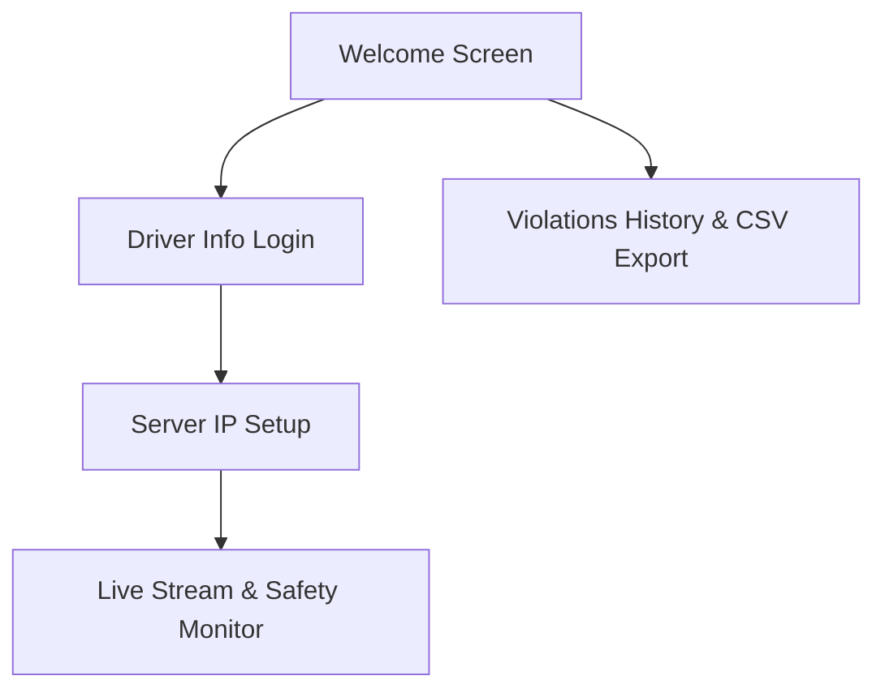

# SafeDrive AI - Driver Monitoring Android Client

This directory contains the source code for the **SafeDrive AI** Android application. The app functions as the user-interface monitoring terminal for the **Driver Monitoring System**. It connects over a local TCP socket to a Raspberry Pi streaming server, displays the live camera feed with active bounding boxes, and automatically logs and saves photos of unsafe driving events to the device's system gallery.

---

## 📱 Application Flow & UI Modules

The application is structured into five core activities, written in Kotlin:

1. **`WelcomeActivity`**: The entry screen offering two main paths:
   * **Start Monitoring**: Launches the login screen to register driver/vehicle parameters.
   * **View History**: Launches the event dashboard to review locally recorded violations and export logs.
2. **`LoginActivity` / `RegisterActivity`**: A persistent driver registration form. Saves variables inside Android `SharedPreferences` (`UserPrefs`) for persistent recall across sessions:
   * Driver Name (`UserName`)
   * Phone Number (`UserPhone`)
   * Car License Plate Number (`CarNumber`)
   * Aadhar Identity Card Number (`AadharNumber` - 12-digit validation)
3. **`AboutActivity`**: A simple configuration dashboard where the driver inputs the active local IP address of the Raspberry Pi server (e.g. `192.168.137.8`) to begin streaming.
4. **`MainActivity`**: The operational dashboard of the application. It establishes the TCP socket client, manages background video frame decoding coroutines, requests real-time geographic locations, generates high-resolution watermarks, saves images, and logs events.
5. **`HistoryActivity`**: A visual ledger of unsafe events. It reads the local CSV file, renders each entry into a card container with red alert borders, and enables quick CSV exporting to external apps (like Google Drive, Email, or WhatsApp).

---

## ⚙️ Technical Core Specifications

### 1. TCP Socket Streaming Client
In `MainActivity`, the client establishes a raw TCP socket connection on port `5000` to the user-defined IP address. The data fetching loop runs continuously in a background thread using Kotlin Coroutines (`Dispatchers.IO`).
It parses incoming packets using the following Big-Endian byte protocol:
* **Header Block (8 Bytes)**:
  * First 4 bytes: `tagLength` (Int, size of the alert status string).
  * Next 4 bytes: `imageLength` (Int, size of the JPEG compressed frame).
* **Payload Block**:
  * `tagBytes`: Read using `dis.readFully(tagBytes)` and converted to a UTF-8 string to determine the alert state (e.g., `"Drowsy"`, `"Smoking"`, `"Phone Usage"`, `"Safe"`).
  * `imageBytes`: Read using `dis.readFully(imageBytes)` and decoded into a displayable Android `Bitmap`.

### 2. High-Resolution Watermarking & Gallery Storage
When the TCP socket receives a violation tag (`Drowsy`, `Yawn`, `Smoking`, `Distraction`, `Phone Usage`), the application processes the image for storage:
* **5-Second Cooldown**: Prevents storage flooding by limiting captures to one event every 5 seconds.
* **3x Scale Factor (HD Text Rendering)**: The incoming video frame is small ($320 \times 240$ pixels). Drawing text directly onto this small image makes the text pixelated when viewed in the system gallery. The app scales the image up by 300% (to $960 \times 720$ pixels) before rendering text.
* **Crisp Overlays**: Uses standard Android canvas painting with digital font smoother (`isAntiAlias = true`) and a drop shadow layer to draw the following overlay text:
  * Active Alert Type (e.g., `ALERT: Phone Usage`)
  * Human-readable Location (e.g., `New Delhi, Delhi` or GPS coords)
  * Precise Timestamp (formatted as `yyyy-MM-dd HH:mm:ss`)
* **Gallery Integration**: Saves the watermarked image to the device gallery using the modern `MediaStore.Images.Media.insertImage` library.

### 3. Geolocation Tagging
To provide physical evidence of when and where driving incidents occur, the app requests location parameters in the background:
* Leverages Google Play Services Location API (`FusedLocationProviderClient`) using the balanced power accuracy priority scheme.
* Implements a background Android `Geocoder` lookup to translate latitude and longitude double values into user-friendly names (such as City and State).
* If the device is offline or the geocoding server is unreachable, the app falls back to printing numerical coordinates (`Lat: XX, Lng: YY`).

### 4. Local Excel/CSV Logging & Provider Exporting
Every violation triggers a logging event where the system updates a persistent comma-separated database:
* **Log Location**: Stored as a CSV file named `SafeDrive_Alert_Log.csv` within the app's secure sandbox directory (`getExternalFilesDir(null)`).
* **Header Structure**: Writes `Timestamp,Driver Name,Car Number,Alert Type,Location` on initial creation.
* **Safe CSV Writing**: Automatically cleans strings (e.g., replacing commas in geographic lookups with hyphens) to prevent column shifting issues when viewed in Microsoft Excel.
* **Security & Exporting**: `HistoryActivity` uses a secure Android `FileProvider` (`androidx.core.content.FileProvider`) configuration with `grantUriPermissions` to safely stream the CSV file to external sharing apps as `text/csv`.

---

## 🔒 Android Permissions

To ensure functional operation, the app requests the following security permissions in `AndroidManifest.xml`:

| Permission Name | Context Type | Purpose |
| :--- | :--- | :--- |
| `android.permission.INTERNET` | System | Permits connection to the Raspberry Pi socket on port 5000. |
| `android.permission.ACCESS_FINE_LOCATION` | User Dialog | Allows high-accuracy GPS monitoring for watermarking. |
| `android.permission.ACCESS_COARSE_LOCATION` | User Dialog | Provides fallback network-based location tracking. |
| `android.permission.WRITE_EXTERNAL_STORAGE` | Backward-Compat | Permits storage writing on Android SDK versions 28 and older. |

---

## 🛠️ Build Configuration

* **Android Gradle Plugin (AGP)**: `9.1.1`
* **Minimum Android SDK Compatibility**: API Level `24` (Android 7.0 Nougat)
* **Target/Compile SDK**: API Level `36` (Android 14)
* **Java Compatibility**: JDK `11` (configured via Java compile options in build.gradle.kts)
* **Dependencies**:
  * `com.google.android.gms:play-services-location:21.2.0` (Fused Location Client)
  * `androidx.core:core-ktx:1.18.0` (Kotlin core extensions)
  * `androidx.appcompat:appcompat:1.7.1` (Android compatibility UI)
  * `androidx.constraintlayout:constraintlayout:2.2.1` (Responsive dashboard construction)

To compile the application, import the directory `D:\CD\android_apk_code` into **Android Studio**, synchronize Gradle files, and execute a build or run the app on an active Android emulator or physical device.
